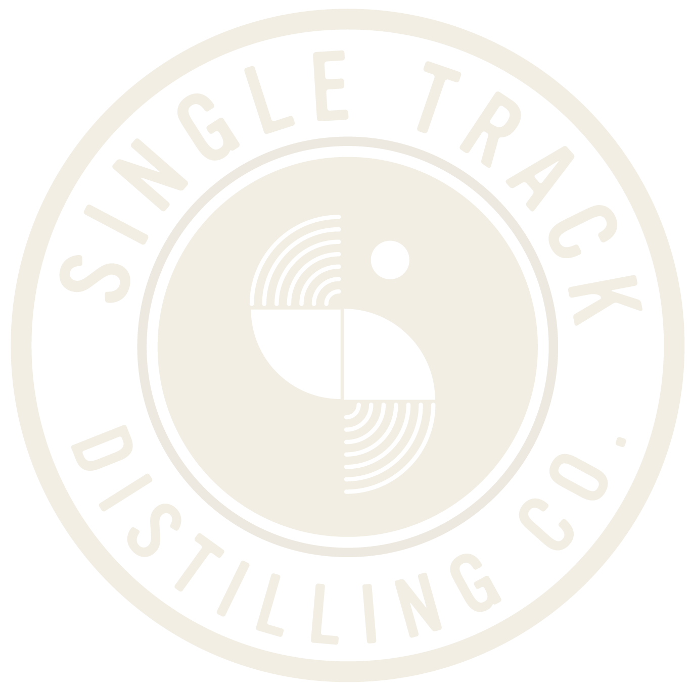

<br />
<div align="center">
  <a href="https://github.com/natashapettinger/myttb">
    
  </a>

<h3 align="center">myTTB</h3>

  <p align="center">
    Software to help small distilleries manage inventory, record manufacturing data, optimize yields, and fill out federal reporting paperwork.
    <br />
    <a href="https://github.com/natashapettinger/myttb/wiki/user-flow"><strong>User Flow in Wiki »</strong></a>
    <br />
    <br />
    <a href="https://github.com/natashapettinger/myttb-client">View Demo</a>
    ·
    <a href="https://github.com/natashapettinger/myttb-client/issues">Report Bug</a>
    ·
    <a href="https://github.com/natashapettinger/myttb-client/issues">Request Feature</a>
  </p>
</div>


<!-- TABLE OF CONTENTS -->
<details>
  <summary>Table of Contents</summary>
  <ol>
    <li>
      <a href="#about-the-project">About The Project</a>
      <ul>
        <li><a href="#tech-stack">Built With</a></li>
        <li><a href="#demo">Demo</a></li>
        <li><a href="#features">Features</a></li>
      </ul>
    </li>
    <li>
      <a href="#getting-started">Getting Started</a>
      <ul>
        <li><a href="#prerequisites">Prerequisites</a></li>
        <li><a href="#run-locally">Run Locally</a></li>
        <li><a href="#environment-variables">Environment Variables</a></li>
      </ul>
    </li>
    <li><a href="#usage">Usage</a></li>
    <li><a href="#roadmap">Roadmap</a></li>
    <li><a href="#lessons-learned">Lessons Learned</a></li>
    <li><a href="#contributing">Contributing</a></li>
    <li><a href="#license">License</a></li>
    <li><a href="#contact">Contact</a></li>
    <li><a href="#acknowledgments">Acknowledgments</a></li>
    <li><a href="#legal">Legal</a></li>
  </ol>
</details>

## About the Project

Keeping track of your spirits manufacturing is a lot of work! This is a fullstack web app that records the data on your 
* 🌾 raw materials inventories
* 🛁 ferments
* 🥃 distillations
* 🛢 warehouse operations
* 📦 processing operations
* and more 


that are necessary to make filling out your monthly TTB reports a breeze 🍃. Built for distilleries who are just starting out and cannot afford to subscribe to the popular paid solutions.

### Tech Stack

This project was bootstrapped with [Create React App](https://github.com/facebook/create-react-app).

Client:
<p><a href="https://developer.mozilla.org/en-US/docs/Web/JavaScript" target="_blank" rel="noreferrer">  </a> <a href="https://www.mongodb.com/" target="_blank" rel="noreferrer">  </a> <a href="https://nodejs.org" target="_blank" rel="noreferrer">  </a> <a href="https://reactjs.org/" target="_blank" rel="noreferrer">  </a> </p>


<p align="right">(<a href="#readme-top">back to top</a>)</p>


Dependencies: ```dotenv```

### Demo
[myTTB](https://#)
```
To avoid signing up, you may log in with the following credentials:
- Email: WeLikeWhiskey@gmail.com
- Password: drinkwhiskey!1234
```
Demo is currently offline.
~~Not all functionality is available in the demo. All pages will be viewable, but form submissions will not lead to changes in the database.~~


### Features
* Secure login with JWT
* TTB form templating

<p align="right">(<a href="#readme-top">back to top</a>)</p>


<!-- GETTING STARTED -->
## Getting Started

To get a local copy up and running, follow these simple steps.

### Prerequisites

You must have node installed in order to run the back end.


  ```bash
    npm install npm@latest -g
  ```


### Run Locally
1. Clone the project
  ```bash
    git clone https://github.com/natashapettinger/myttb-client.git
  ```

2. Go to the project client directory and install dependencies
  ```bash
    cd myTTB/client
    npm install
  ```

3. Navigate to the project server directory and install dependencies
  ```bash
    cd ../server
    npm install
  ```

5. Make sure you have your [environment variables](#environment-variables) saved in your `.env` file in the server/config directory.

6. Start the client and server

    a) With nodemon
    ```bash
      npm run dev
    ```

    b) With node
    ```bash
      npm run start
    ```

7. Navigate to the local host port that the client is running on in your browser.

<p align="right">(<a href="#readme-top">back to top</a>)</p>


### Environment Variables

To run this project, you will need to add the following environment variables to your `.env` file in `server/config/.env`

`PORT: <port>` (the frontend is set to fetch from http://localhost:8000/api, and setting this to 8000 will not require any changes in the front end if running locally)

MIDDLE WARE for AUTH.

<p align="right">(<a href="#readme-top">back to top</a>)</p>


<!-- ROADMAP -->
## Roadmap

- [ ] Home Page:
    - [ ] Add in toolbox w/ proof calculator
- [ ] Raw Materials Page:
    - [x] ~~Edit capabilities for raw materials~~
    - [x] ~~Fix forms to include ['yeast', 'grain', 'fruit', 'cane-product', 'cleaning product', 'nutrient', 'enzyme', 'packaging supply'] in the dropdown for material type.~~
    - [ ] Add validation that if the type is grain, fruit, or cane-product, UOM must be in lbs or gal.
    - [ ] Bulk data upload for raw materials so you can receive full order at once
- [ ] Production Page:
    - [ ] Yield analysis
    - [x] ~~Edit capabilities for ferment log~~
    - [ ] Edit capabilities for mash steps 
    - [ ] Add analysis for mash steps - heating, cooling, hold at temp durations
    - [ ] Bulk data upload for production
    - [ ] Add form that allows for transfer of spirits from storage to production for redistillation
    - [x] ~~Add form that allows for transfer of spirits out of production for (select) 1. use in research & testing, 2. transfer to another bonded facility, & reasons 1-8 on production operations form.~~
    - [x] ~~Add form that allows for transfer of spirits from storage to processing, keeping intact the ferment data.~~
- [ ] Warehousing Page:
    - [x] ~~Edit capabilities for warehouse tanks~~
    - [x] ~~Transfer out of storage account form (keep logs of this)~~
    - [ ] Make summary at top of page: proof gallons in storage, proof gallons in tanks, proof gallons in new coop, proof gallons in used coop.
- [ ] Processing Page:
    - [ ] Add form fields that give the spirit type (valid entries in processing operations form PART IV), 
    - [ ] Connect raw materials database to processing
    - [ ] Add cost analysis in to processing
- [ ] TTB Reporting
    - [ ] Frontend for production operations form
        - [x] ~~Operations form table~~
        - [x] ~~List of available months~~
        - [x] ~~Process month form~~
    - [ ] Frontend for warehousing operations form
        - [x] ~~Operations form table~~
        - [x] ~~List of available months~~
        - [x] ~~Process month form~~
    - [ ] Frontend for processing operations form
        - [ ] Operations form table
        - [x] ~~List of available months~~
        - [x] ~~Process month form~~
    - [ ] Lowest priority: Frontend for processing (denaturing) operations form
        - [ ] Operations form table
        - [ ] List of available months
        - [ ] Process month form
- [ ] General:
    - [x] ~~Working frontend for raw materials, production, warehousing, and processing~~
    - [ ] Refactor JSX & clean up components folder
    - [x] ~~Make it responsive~~
    - [ ] ~~Fix styling~~
    - [ ] Add cleaning schedule/process page
    - [ ] Add finished goods page that tracks how much of each batch is left, where each batch goes, etc.
    - [x] ~~Make footer~~

See the [open issues](https://github.com/natashapettinger/myttb/issues) for a full list of proposed features (and known issues).

<p align="right">(<a href="#readme-top">back to top</a>)</p>


## Lessons Learned
🌱 There will always be time to refactor. Getting a working MVP is the priority.

<p align="right">(<a href="#readme-top">back to top</a>)</p>


<!-- CONTRIBUTING -->
## Contributing

If you have a suggestion that would make this better, please fork the repo and create a pull request. You can also simply open an issue with the tag "enhancement".
Don't forget to give the project a star! Thanks again!

1. Fork the Project
2. Create your Feature Branch (`git checkout -b feature/AmazingFeature`)
3. Commit your Changes (`git commit -m 'Add some AmazingFeature'`)
4. Push to the Branch (`git push origin feature/AmazingFeature`)
5. Open a Pull Request

<p align="right">(<a href="#readme-top">back to top</a>)</p>


<!-- CONTACT -->
## Contact

Natasha Pettinger - [LinkedIn](https://www.linkedin.com/in/natasha-pettinger/) - [Website](https://npettinger.netlify.app/)

Project Link: [https://github.com/natashapettinger/myttb-client](https://github.com/natashapettinger/myttb-client)

<p align="right">(<a href="#readme-top">back to top</a>)</p>


## Legal

This software is meant to make federal reporting easier, but is not meant to be a complete substitute for alcohol tracking and reporting. You are responsible for ensuring accuracy in your TTB reports. We take no responsibly for inaccurate reporting that may arise through the use of this software. 
